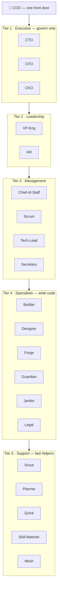
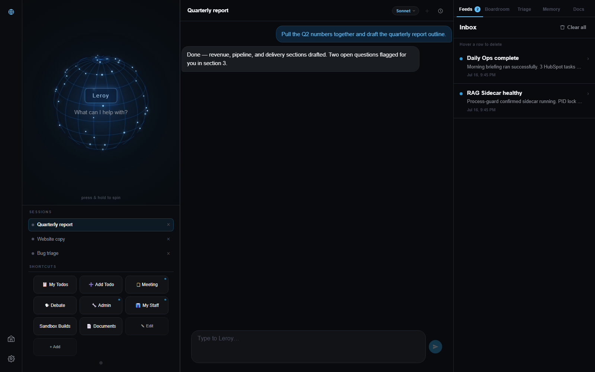
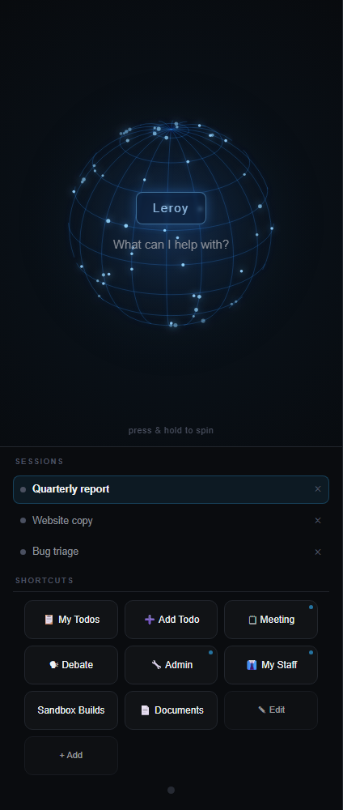
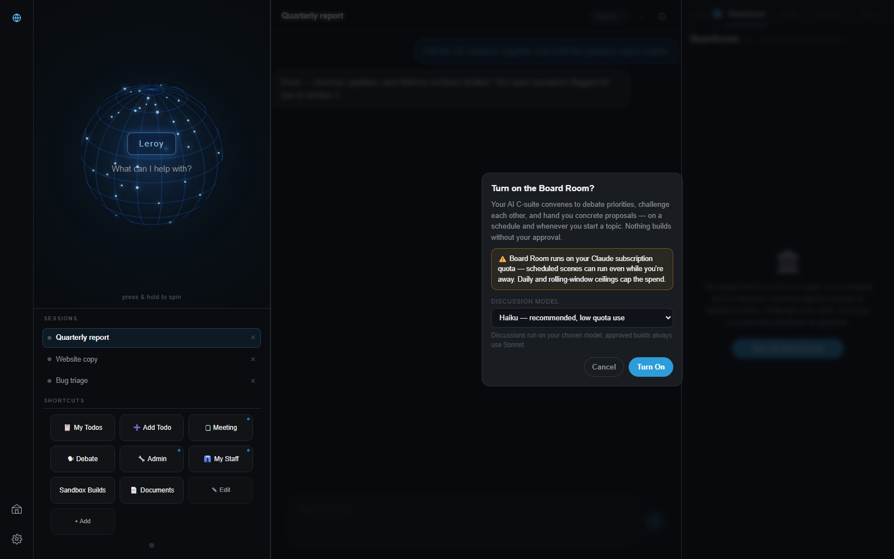

<!-- ============================================================= -->
<!--  LEROY-HQ — README                                            -->
<!--  A self-growing AI company you run as a desktop app.          -->
<!-- ============================================================= -->

<p align="center">
  
</p>

<p align="center">
  
</p>

<p align="center">
  
  
  
  
  
  
  
</p>

<p align="center">
  <a href="#-download--install">Download</a> ·
  <a href="#-leroy-ui">The app</a> ·
  <a href="#-the-org-chart--27-agents-5-tiers">Architecture</a> ·
  <a href="docs/">Docs</a> ·
  <a href="#-recent-updates">Recent Updates</a>
</p>

---

## 📰 Recent Updates

*A living log so you can see the system is actively growing, not a one-time drop.*

**2026-07-17 — LeRoy is now a desktop app: download, open, done**
LeRoy ships as a **Windows desktop app** — one download, no terminal required. You get session
tabs, the live org-chart globe, an inbox, the Kanban triage board, and the Board Room where your
executive agents debate and hand you decisions. It walks you through installing everything on
first launch and builds your memory as you answer a few questions. The Board Room ships **off by
default** (it spends tokens on a schedule) — flip it on in one click when you want it, on the
low-cost model. Grab the installer from the
[Releases page](https://github.com/Zeekeey-jpeg/LeRoy-HQ/releases/latest).
*(A terminal/CLI surface still exists for builders — see the note at the bottom.)*

**2026-07-15 — Smart Todos gained a backstory layer**
The built-in todo skill now supports an optional second layer per task: a linked paper-trail
file (who asked, correspondence history, decisions, what's left) for the items worth
remembering the "why" on weeks later — while everyday items stay a one-line row. Paired with
an explicit memory-push-and-verify step, so a written note is actually retrievable later, not
just sitting on disk unindexed. See [`skills/routines/smart-todos.md`](skills/routines/smart-todos.md).

---

## What is LeRoy, actually?

LeRoy is an **AI orchestration layer** that turns Claude Code into a usable AI division —
a whole organization of specialists sharing one memory, instead of a chat window that
forgets you the moment the session ends.

Think about hiring a real team: the first few months are the expensive part, while they
learn how you like things done. **LeRoy is that team already past onboarding** — installed
in about 15 minutes, it gives you a chief-of-staff who routes what you throw at it,
specialists who do the work, and a memory that never resets.

### 🤔 Why would you actually download this?

Every Claude Code session normally starts from zero — you re-explain context, re-paste
files, re-teach it your preferences, every time. LeRoy remembers permanently, across every
session, and skips the months of work (org chart, routing, memory, guardrails) that building
this yourself would take.

### 🎯 What does it actually do for you?

| You say... | ...LeRoy does this | ...so you get |
|---|---|---|
| "Draft the follow-up to yesterday's proposal" | Routes it to the right specialist, recalls the actual thread from memory, writes it in your voice | A finished draft, not a blank page — no re-explaining the deal |
| "Should we take this deal / hire / feature on?" | Convenes a debate between five perspectives (act-now, long-view, what-breaks, people, structure) and logs a verdict | A real decision with the reasoning saved — not a vibe you'll forget you had |

### 🆚 Why this instead of just using Claude Code as-is?

Vanilla Claude Code is a capable employee with amnesia — sharp in the room, forgets you the
moment the session ends. LeRoy is the organization built around that employee: the memory,
the division of labor, the guardrails — the stuff a real company builds over months,
pre-built and running in 15 minutes. **That's the whole pitch.**

<p align="right"><i>Curious how it actually works under the hood — the agents, the memory,
the guardrails? Keep reading below.</i></p>

---

## ⬇️ Download & install

**No terminal, no commands — download the app, run it, and you're talking to your AI company in
about 15 minutes.**

### 🌟 About to install? Scroll up and hit **Star** first — one click, and it helps other people stumble onto this the way you just did.

<p align="center">
  <a href="https://github.com/Zeekeey-jpeg/LeRoy-HQ/releases/latest/download/LeRoy-UI-Setup.exe">
    
  </a>
  <br/>
  <sub><a href="https://github.com/Zeekeey-jpeg/LeRoy-HQ/releases/latest">release notes &amp; all versions →</a></sub>
</p>

1. **[⬇ Download the LeRoy UI installer](https://github.com/Zeekeey-jpeg/LeRoy-HQ/releases/latest/download/LeRoy-UI-Setup.exe)** — the button above grabs the `.exe` straight to your Downloads folder (or browse [all releases](https://github.com/Zeekeey-jpeg/LeRoy-HQ/releases/latest)).
2. **Run it and launch LeRoy UI** — it drops a shortcut on your Desktop and Start Menu.
3. **Follow the first-launch walkthrough.** LeRoy checks your setup, asks a few questions about
   you and your work, and builds your memory as you answer. From then on you just open the app.

The app **auto-updates itself** from Releases, so you always have the latest LeRoy.

### ✅ Requirements

- A **Claude subscription** (heavy/autonomous use → **Max tier**). **Recommended model: Claude
  Sonnet** — the best balance of speed, cost, and capability; the boardroom can still pin
  high-stakes calls to a top-tier model when it matters.
- **[Claude Code](https://claude.com/claude-code) installed and signed in** — LeRoy runs on top
  of it. **LeRoy UI checks for this on first launch and points you to the installer if it's
  missing**, so you don't have to hunt for anything.
- **Windows only today**; macOS/Linux are on the roadmap, not shipped.

**No login, no account, no cloud — LeRoy runs entirely on your machine.** There's nothing to
sign into and it doesn't phone home; it's local-to-local by design. (It binds `127.0.0.1` only
and has no auth layer — treat it like a local dev tool, not something to expose to a network.)

---

### By the numbers
**27** agents across **5** governed tiers · **1,063** gate checks at **100%** compliance ·
warm recall **3251ms → 1622ms** · A2A mesh **2–10×** speedup · memory is **100% yours**,
plain markdown on your disk.

---

## 🏆 Why this isn't "another pile of agents"

Anyone can drop 30 agent prompts in a folder — that's the slop. LeRoy is a **system with a
control plane.** A couple of the differences that actually matter:

| Everyone has… | **LeRoy has instead…** |
|---|---|
| A bag of agents you wire yourself | A **governed org chart** — one router, 5 tiers, enforced tool-access |
| A vector store you dump text into | A memory that **forgets the right things** (confidence decay) |

**The tell for a technical reader:** LeRoy is *deterministic* (a mandatory gate guarantees
recall + routing every turn), *governed* (agents have a tool-access matrix — the C-suite
literally can't write to disk), and *self-repairing* (a tiered auto-fix engine edits code in
isolated git worktrees and rolls back on failure). Every safety rail traces to a real past
incident. That's an operating system, not a prompt dump.

---

## 🔬 A reasoning layer on top of the model

LeRoy adds a second layer of **algorithmic instinct** on top of the model — before it closes
a fix, it asks *is this isolated or systemic, and does the fix cover every instance of the
problem, not just the one you named?* It fixes the *class* of problem, not just the instance
in front of it.

## 🧠 Agents that compound — and a COO that connects the dots

Every agent keeps its **own journal** and learns as it works. That memory **persists across
sessions**, so a fresh spawn is briefed with its own history instead of starting cold — the
team gets sharper the more you use it.

And the COO holds the **30,000-foot view**. When one agent changes something in its domain, the
COO works out *who else is affected* — a change to a client record means the legal and finance
agents should know — and routes that awareness automatically (the **IMPACT protocol**).
Cross-agent impact is caught at the one place that sees every agent's output, then written to a
growing per-agent memory. One hand always knows what the other is doing.

---

## 🔓 Autonomy is opt-in (the working car)

LeRoy ships **fully capable** — but it doesn't do anything autonomous until you say yes.
Think of it like a car delivered with the engine running and the doors unlocked: the *good,
non-token-burning* features are **on by default**, and the *token-burning / self-driving*
features are **off** until you turn each one on. Nothing runs on a timer, watches your inbox,
or spends tokens in the background unless you explicitly enable it.

The autonomous features are enabled **à la carte** — during first-launch onboarding, or later,
one toggle at a time from the app. Each one shows you what it does (and what it costs) before it
turns on.

| On by default (safe, no background spend) | Opt-in (autonomous / uses tokens) |
|---|---|
| Self-growing memory (capture + recall) | Boardroom (24/7 debates) |
| Self-heal in **observe** mode | Morning briefing |
| The deterministic gate | Email digests |
| Request routing | Scheduled crons |
| MCP-builder (build connectors on ask) | |

**Bottom line:** everything that makes LeRoy smart works out of the box; everything that runs
*without you in the loop* stays dark until you flip it on.

---

## 🧭 The org chart — 27 agents, 5 tiers

Every request enters one front door (the **COO**). It sizes the job and answers, delegates,
or deploys a team. Agents also talk **peer-to-peer** (A2A mesh — DELEGATE / SUBSCRIBE / CACHE,
with hop limits + circuit breakers) for 2–10× speedup on big jobs. LeRoy scales the crew to
the *shape* of the work — see [docs/scaling.md](docs/scaling.md).



<details>
<summary><b>See the full tier table</b></summary>

<br/>

| Tier | Role | Examples | Writes code? |
|---|---|---|---|
| 1 — Executive | strategy, governance, veto | COO · CTO · CFO · CKO | ❌ govern only |
| 2 — Leadership | coordination & delivery | VP-Eng · HR | ❌ |
| 3 — Management | tracking & lifecycle | Chief-of-Staff · Scrum · Tech-Lead · **Secretary** | ❌ |
| 4 — Specialists | the doers | Builder · Designer · Forge · Guardian · Janitor · **Legal** · Proposal-writer | ✅ full |
| 5 — Support | fast, silent helpers | Scout · Planner · Quick · Skill-Matcher · Mesh | ⚙️ scoped |

*Authority and tool-access are **enforced**, not suggested — separation of powers for AI.*
*(Plus an opt-in **`security`** squad — cyber-operator, ai-sec, recon — for authorized testing.)*

</details>

---

## 🧩 Skills — predicted, not memorized
A large library of capabilities (markdown + logic). High-frequency intents route instantly;
anything novel is matched semantically and surfaced *before you ask*. Drop in a new file and
it's discoverable. LeRoy also **watches your patterns and proposes new skills** *(alpha)*.

## 🔌 MCPs — it builds its own connectors
Speaks [Model Context Protocol](https://modelcontextprotocol.io). LeRoy doesn't ship a pile
of pre-baked third-party connectors — it ships the thing that **makes** them: a built-in
**MCP-builder agent + skill** (see [mcps/](mcps/)). Tell it what you want to talk to and it
scaffolds the server, wires the tools, and drops a local `.env` for your key.
> **Just ask — "talk to my Notion" → it builds the connector for you.**
> If it has an API, LeRoy can reach it — nothing to hunt for on a marketplace.

## 🧠 Memory — self-growing, Obsidian-native, never "saved"
A human-readable vault on **your** disk (browse it, `grep` it, own it).
- **Always-on capture** — every conversation is distilled, chunked, embedded. No save button.
- **Confidence decay** — facts you *stated* are permanent; facts it *inferred* decay unless
  re-confirmed, so old guesses don't rot recall.
- **Doc-RAG firewall** — drop in a PDF/DOCX; raw source is retrievable on demand but kept out
  of default recall so summaries surface first.
- **Warm sidecar** — a local RAG service serves recall in milliseconds, ships as Python you
  can read.

```
capture → distill → chunk → embed → graph
```

> **See your brain** — point [Obsidian](https://obsidian.md) at `~/.claude/memory` and open
> **Graph View** to watch your second brain grow: every `[[wiki-link]]` LeRoy writes becomes
> an edge. Plain markdown, no export, no lock-in. *(Obsidian is free.)*

## 🏛️ The Boardroom *(optional — off by default)*
Consequential decisions convene a council — General (act now), Sage (5-yr), Skeptic (what
breaks), Diplomat (people), Architect (structure) — plus an Inquisitor. It votes and logs the
verdict. It's **opt-in** (one toggle in the app) because a 24/7 boardroom uses tokens; a
governor caps spend either way to protect a flat plan.

## 🔧 It runs — and repairs — itself
- **Self-healing auto-fix:** audit → fix → verify → **auto-rollback**, in tiers (safe fixes
  auto, risky ones need approval), with a protected-path wall and git checkpoints.
- **Janitor** audits and cleans the whole system on a schedule.
- **Wake-coalescer** collapses missed jobs into one digest — no task storms.
- **Self-policing automation:** nothing autonomous can create a scheduled job without an
  approved entry in the automation registry.

## ⚡ Deterministic by design — "Position Zero"
Before *every* response a mandatory pre-flight runs: load identity → recall memory → route →
act. Enforced by a hook, not by hoping. This is why LeRoy stays consistent across thousands of
turns instead of drifting — and every gate emission is written to the **gate log** for audit.

---

## 🖥️ LeRoy UI

The desktop app is how you use LeRoy — everything below runs on your machine, no terminal in
sight. **[Download it from Releases.](https://github.com/Zeekeey-jpeg/LeRoy-HQ/releases/latest)**

<p align="center">
  
  <br/><i>the desktop layout: 3D session globe · chat · live feeds rail</i>
</p>

**Multi-session, for real.** Up to **3 concurrent sessions**, each in a stable slot with its own
tab in the session strip — and each keeps its own model choice. Close a conversation, keep the
slot.

<p align="center">
  
  <br/><i>three sessions side by side, each with its own model</i>
</p>

**The tabs.** The right rail switches between **Feeds · Board Room · Kanban · Activity ·
Memory · Documents** — triage decisions, watch the org work, browse your brain, drop in
documents for RAG.

**🏛️ The Board Room ships OFF by default.** Autonomous debates are the single most token-hungry
thing LeRoy does, so the app makes you opt in: one click, after a popup that explains what it
does and warns that scheduled scenes run on *your* Claude quota — even while you're away. It runs
on **Haiku by default** (fast, cheap); a dropdown lets you knowingly step up to Sonnet or Opus.
Daily and rolling token ceilings cap the spend either way.

<p align="center">
  
  <br/><i>opt-in by design: the enable popup, token warning and all</i>
</p>

**Honest scope notes:**
- The isometric **Warehouse view is not in this release** — it stays a private-build toy for now.
- LeRoy UI runs **entirely on your machine**: it binds `127.0.0.1` only and has **no
  authentication layer** — treat it like a local dev tool, not something to expose to a network.

---

## 🔒 Your data is yours
Memory lives **on your machine** as plain files. API keys stay in local `.env` files that
never enter the repo. LeRoy doesn't phone home. The app **auto-updates itself** from Releases —
pulling *our* code without ever touching *your* grown memory. Code and brain are separate layers.

---

## 🛠️ Advanced / builders — the CLI is still there
Prefer the terminal, or want to fold LeRoy into an existing `~/.claude`? A full command-line
surface still ships in this repo. Clone it and run setup — it backs up any existing Claude Code
config and merges LeRoy in additively, nothing overwritten:
```powershell
git clone https://github.com/Zeekeey-jpeg/LeRoy-HQ "$HOME\LeRoy-HQ"
cd "$HOME\LeRoy-HQ"
.\setup.ps1
```
The desktop app is the supported path for everyone else — this is just the door for builders.

---

<p align="center"><sub>Built by <a href="https://helpmebim.com">HelpMeBIM</a> · MIT · Made with Claude</sub></p>
<p align="center">
  
</p>
